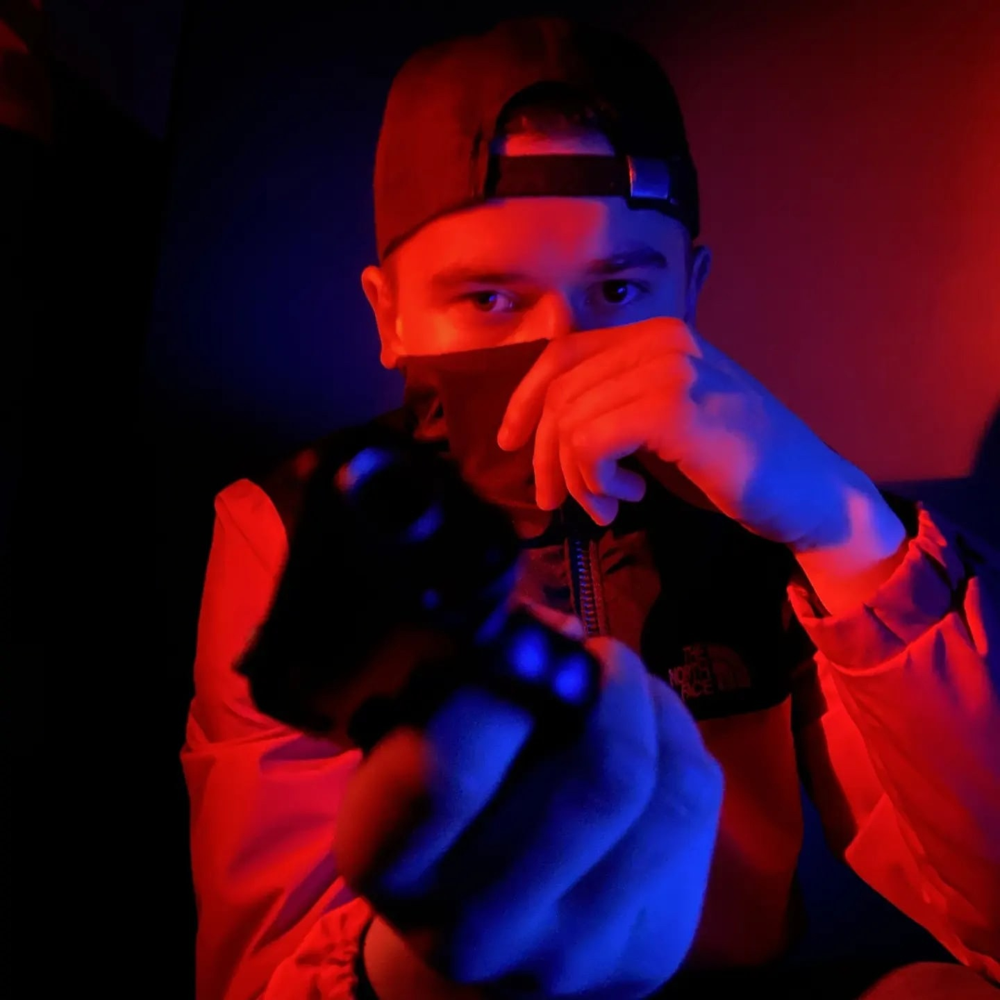

# Egor Isakovich
<br>

### Links:
[GitHub](https://github.com/losker123) / [Telegram](https://t.me/Losker1) 
/ [Vk](https://vk.com/losker1)

# About me
I am a second-year student at the Faculty of Computer Science and live in Belarus. My main area of interest is related to software development, especially using the C# programming language and the WinUI3 framework.
Despite the fact that I do not have any work experience or internship yet, I am actively engaged in various projects in order to accumulate sufficient experience. 
However, in addition to specific technologies and tools, I also focus on developing my logical thinking and problem solving skills. I am actively engaged in solving various tasks, which helps me develop analytical and problem-oriented skills.

## My stack of technologies 
 - C# 
 - WinUi 3
 - SQL ( MS SQL Server)
 - C++

## My projects
 - [RaidDesigner:](https://github.com/losker123/RaidDesigner.git)
An application on WinUI 3 that provides an opportunity to study and test your knowledge in the field of RAID technology

## Code example
Usage example Semaphore
```
    static Semaphore semaphore = new Semaphore(1, 1); 
    
    for (int i = 1; i <= 3; i++)
    {
        Thread thread = new Thread(EnterCriticalSection);
        thread.Name = "Поток " + i;
        thread.Start();
    }

    Console.ReadLine();
    
    static void EnterCriticalSection()
    {
        Console.WriteLine(Thread.CurrentThread.Name + " ждет разрешения.");
        semaphore.WaitOne(); 

        Console.WriteLine(Thread.CurrentThread.Name + " входит в критическую секцию.");
        Thread.Sleep(2000); 

        Console.WriteLine(Thread.CurrentThread.Name + " покидает критическую секцию.");
        semaphore.Release();

        Console.WriteLine(Thread.CurrentThread.Name + " освободил разрешение.");
    }
```